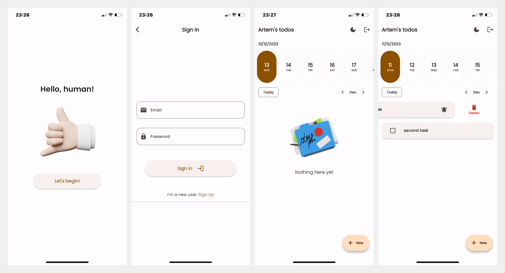
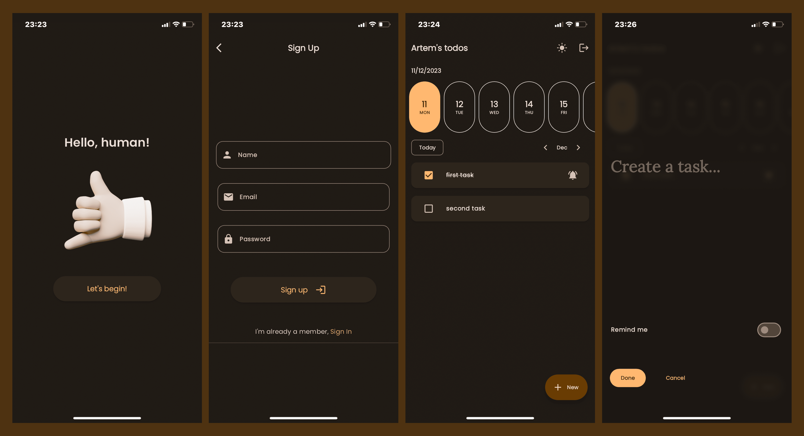

# A simple yet beautiful to-do app

## Changelog

### 2023.12:

-   now a task marks itself done once you press it, to edit you still just make a long tap
-   added the "Do tomorrow" sliding item for tasks, to transfer them to the next day
-   bug fixes

## Reproduction

1. Clone the repo, install the dependencies: `flutter pub get`

2. Register the app with your Firebase project: `flutterfire configure`

3. Generate the icons: `dart run flutter_launcher_icons`

4. Open the app's workspace in XCode (`./ios/Runner.xcworkspace`), in "Signing & Capabilities" select Personal Team

5. Build: `dart run build_runner build && flutter build ios`

6. Connect a device with iOS 17 or later, with Developer Mode enabled

7. Install the built app container (`./build/ios/iphoneos/Runner.app`), via XCode: Windows > Devices and Simulators > Installed apps

8. Mark the app "trusted" in the iPhone's `General > VPN & Device Management` settings section

9. Enjoy
