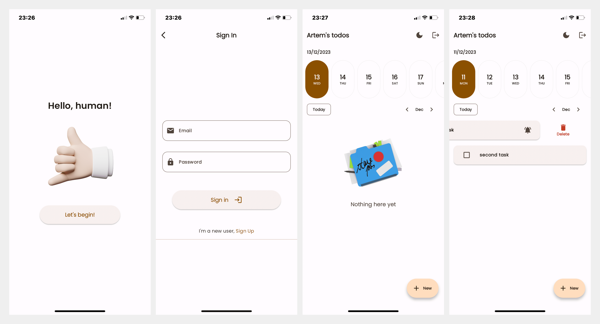
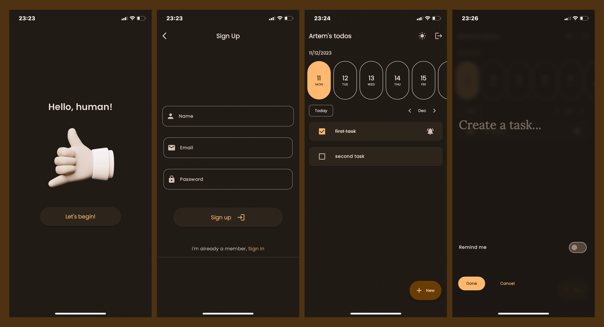

# A simple yet beautiful to-do app

## Changelog

### 2026.02:

-   Upgraded project toolchain to Flutter `3.41.2` (Dart `3.11`) with FVM-first workflow.
-   Modernized code to newer Dart patterns (including dot shorthand usage)

### 2025.03:

-   Added bottom navigation bar for easier app navigation.
-   Implemented a profile screen to display user information and activity.
-   Moving a completed task to the next day now unchecks it

### 2023.12:

-   now a task marks itself done once you press it, to edit you still just make a long tap
-   added the "Do tomorrow" sliding item for tasks, to transfer them to the next day
-   bug fixes

## Reproduction (iOS)

1. Clone the repo, install dependencies with FVM: `fvm flutter pub get`

2. Install Firebase + FlutterFire CLIs (if missing):
   - `sudo curl -sL https://firebase.tools | bash`
   - `fvm dart pub global activate flutterfire_cli`
   - `firebase login`

3. Register the app with your Firebase project:
   - `fvm dart pub global run flutterfire_cli:flutterfire configure --platforms=ios`
   - Enable Email & Password in Firebase Auth.

4. Generate code and icons:
   - `fvm dart run build_runner build --delete-conflicting-outputs`
   - `fvm dart run flutter_launcher_icons`

5. Install iOS pods once dependencies are resolved:
   - `cd ios && pod install`

6. Open the app workspace in Xcode (`./ios/Runner.xcworkspace`) and in "Signing & Capabilities" select your Team.

7. Build with FVM:
   - Local validation build (no signing): `fvm flutter build ios --debug --no-codesign`
   - Device build (with signing configured in Xcode): `fvm flutter build ios`

8. Connect a device with iOS 17 or later and Developer Mode enabled.

9. Install the built app container (`./build/ios/iphoneos/Runner.app`) via Xcode: Window > Devices and Simulators > Installed apps.

10. Mark the app as trusted in iPhone `General > VPN & Device Management`.

11. Enjoy.

## Notes for contributors

- This repository currently tracks an iOS-first workflow.
- `ios/Runner.xcodeproj/project.pbxproj` is intentionally not tracked in git. Keep your local iOS project metadata in sync by running Flutter migration/build commands locally when needed.
